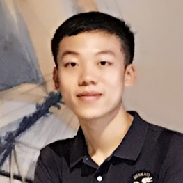

# About Me

I am a Ph.D. student in Quantitative and Computational Biology ( [QCB Graduate Program](https://lsi.princeton.edu/qcbgraduate) ) at [Lewis-Sigler Institute for Integrative Genomics](https://lsi.princeton.edu/), [Princeton University](https://www.princeton.edu/). Prior to joining Princeton, I received my B.S. and B.A. from [Peking University](http://english.pku.edu.cn/) in 2017, received my M.S. from [Department of Biostatistics](https://www.hsph.harvard.edu/biostatistics/) at [Harvard University](https://www.harvard.edu/) in 2019.

# Research Interest

My major research interests lie in developing statistical and computational methods to measure complex biological system, especially focusing on

* High-dimensional statistics

* Combinatorial inference

* Statistical learning

* Causal inference

I have a strong interest in computational neuroscience, while my methods development work finds its main applications in

* Statistical genomics

* Population genetics

* Molecular ecology

# Awards and Honors

* __Lewis-Sigler Institute Scholars Award__ in Quantitative and Computational Biology, awarded by Lewis-Sigler Institute, Princeton University, 2019

* __Outstanding Graduate of Beijing__ as a Bachelor, awarded by the Beijing Municipal Commission of Education, 2017

* __Excellent Graduate__ who has demonstrated outstanding performance, awarded by Peking University, 2017

* __UCLA Cross-disciplinary Scholars in Science and Technology Award__ in recognition of outstanding research and presentation skills, awarded by University of California, Los Angeles, 2016

* __National Scholarship__ awarded by Ministry of Education of the People's Republic of China, 2016 & 2015

# Back to Home
[Homepage](https://yushift.github.io)

